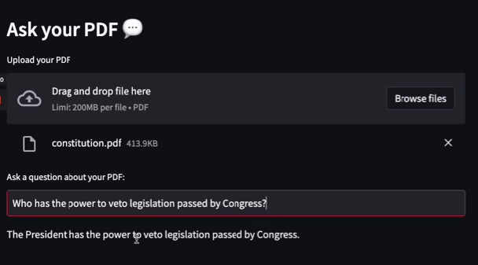

# Ask Your PDF
This is a Python script that allows you to upload a PDF file and ask questions about its content. The script utilizes various libraries and modules to extract text from the PDF, split it into chunks, create embeddings, and perform question-answering on the text.

## Prerequisites
Before running the script, make sure you have the following dependencies installed:

* Python (version 3.6 or later)
* dotenv library
* streamlit library
* PyPDF2 library 
* langchain library (including its sub-modules: text_splitter, embeddings, vectorstores, chains, llms, and callbacks)

* You can install these dependencies using pip:

```pip install python-dotenv streamlit PyPDF2 langchain```

# Getting Started
1. Clone or download the code repository to your local machine. 
2. Create a virtual environment (optional but recommended) and activate it. 
3. Install the required dependencies as mentioned above. 
4. Create a file named .env in the same directory as the script, and add your OpenAI API key to it. Example:

```OPENAI_API_KEY=your_api_key_here```

Replace your_api_key_here with your actual OpenAI API key. This key is necessary for the script to access the OpenAI language model.

5. Run the script using the following command:
```streamlit run script.py```

This will start a local server and open the script in your default web browser.

6. Upload a PDF file by clicking on the "Upload your PDF" button.

7. The script will extract the text from the PDF, split it into chunks, and create embeddings for the text.

8. Enter your question about the PDF in the text input field provided.

9. The script will use the embeddings and the question to search for relevant documents and generate an answer using a question-answering model.

10. The answer will be displayed on the web page.

## Limitations
* The script assumes that the uploaded PDF contains text that can be extracted. If the PDF contains scanned images or non-textual content, the text extraction process may not work correctly.

* The performance and accuracy of the question-answering model may vary depending on the quality of the embeddings, the language model used, and the nature of the text.

* The script currently uses the default settings for text splitting, chunk size, and chunk overlap. You can modify these parameters in the CharacterTextSplitter initialization if desired.

## Acknowledgments
* This script utilizes the langchain library, which provides various functionalities for working with natural language processing tasks.
* The script also utilizes the OpenAI language model for question-answering.
* Special thanks to the authors and contributors of the libraries and modules used in this script for their valuable work.

